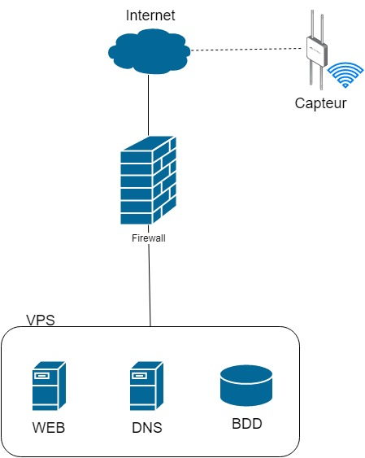

# Description du projet

Ce projet consiste en l'intégration des différentes technologies afin d'arriver à un système de partage de graine qui aidera les futurs agriculteurs amateurs.
Le site étant gratuit, nos clients auront la possibilité d'accéder au maximum des ressources mises à leur disposition afin de trouver les graines parfaites pour leur potager.

Un appareil de suivi de la température et de l'humidité de leur serre sera proposé pour tout client désireux de suivre plus en détail leur potager et ainsi optimiser au mieux la pousse et les récoltes.
Cet appareil sera peu encombrant et ne nécessitera que d'un câble d'alimentation ainsi que d'un accès à internet.

## Liens utiles et outils

Concernant ce projet, voici les liens et outils que nous nous servont :

* _**GitHub**_ : <https://github.com/melvinmajor/seed-IT>
* _**Trello**_ : <https://trello.com/b/XEX3CKmq>
* _**Docker Hub**_ : <https://cloud.docker.com/repository/docker/melvinmajor/seed-it>

Nous avons par ailleurs utilisé un groupe de communication privé dans _**Microsoft Teams**_, tout comme _**Toggl**_ comme outil de timesheet.

# Bilan du Sprint

## Avancement technique

## Méthodologie et gestion d'équipe

## Analyse réflexive du fonctionnement du groupe

# Objectifs du Sprint

## User Stories

* Logo du site web _(Sprint 1, 5 points)_
  * _**Responsable :**_ Filipp Shatskiy
  * _**Description :**_ en tant que client, je souhaite avoir un logo représentant au mieux l'idée derrière ce projet.
  * _**Tâches :**_
    * Création du logo,
    * Création d'une palette de couleurs : permet de faire en sorte que les couleurs d'accentuation du site internet correspondent avec le logo tout en gardant une certaine homogéïnité.
* Contenu du site web _(Sprint 1, 5 points)_
  * _**Responsable :**_ Constantin Mirica
  * _**Description :**_ en tant que client, je souhaite avoir une proposition de contenu pour le site internet.
  * _**Tâches :**_
    * Contenu des pages "Accueil", "A propos", "Contact" et "Boutique".
* Mise en place d'une version simple du site web _(Sprint 1, 3 points)_
  * _**Responsable :**_ Hymed Boussaklatan
  * _**Description :**_ en tant qu'utilisateur, je souhaite avoir un site internet permettant de proposer mes graines de plantes à la vente.
  * _**Tâches :**_
    * Créer les pages "Accueil", "Boutique", "A propos" et "Contact",
    * Réfléchir à une idée de design pour le prochain Sprint.

## Technical Stories

* Achat du VPS et du nom de domaine _(Sprint 1, 0.5 points)_
  * _**Responsable :**_ Melvin Campos Casares
  * _**Description :**_ achat auprès du fournisseur d'accès d'un serveur privé virtuel (VPS) et du nom de domaine.
  * _**Tâches :**_
    * Choisir le nom de domaine,
    * Commander le VPS et le nom de domaine,
    * Configurer auprès d'OVH le lien entre VPS et nom de domaine.
* Démarrage des services sur le VPS _(Sprint 1, 15 points)_
  * _**Responsables :**_ l'équipe entière
  * _**Description :**_ mise en place des services nécessaire sur le VPS pour le bon démarrage du projet.
  * _**Tâches :**_
    * Service Web sous Apache,
    * Service DNS,
    * Base de données,
    * Reverse Proxy,
    * Pare-feu,
    * Sécurisation (Fail2ban, SSH).

## Bug

Aucun bug à prendre en charge pour ce Sprint.

# Timesheet

# Schémas et analyses

# Tests

# Equipe

## Estimation de la vélocité de l'équipe

## Forces et faiblesses du Sprint précédant et mesures prises

Etant donné qu'il s'agit du premier Sprint, nous n'avons pu nous baser que sur l'analyse réalisée par le _Scrum Master_ afin de prendre des mesures adaptées.

# Objectif du prochain Sprint
